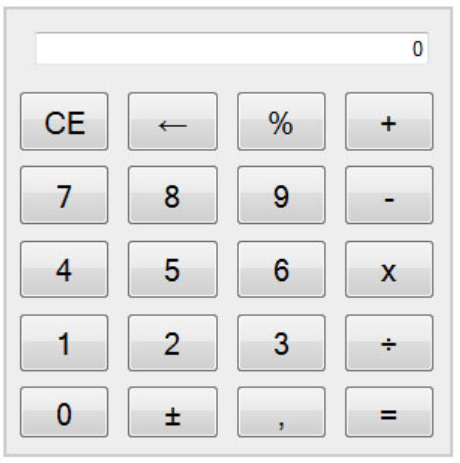

# UD4 Tarea 4.1 Calculadora mediante objeto literal
## Desarrollo Web Entorno Cliente
### José Lafuente Colorado - 2º DAW-B

1. En este repositorio entrega la calculadora de la tarea anterior. Toma como base esta calculadora. Recuerda:
   * Parte de un documento html vacío.
   * Crea los elementos HTML de la calculadora mediante los métodos del objeto predefinido document. Ni tablas ni li, ni document.write() ni fichero.css están permitidos. Dale un buen uso a las etiquetas.
   
   
2. Añádele ahora el comportamiento del display bien controlado (ni +, ni -, ni x ni %):

   1. Inicialmente en el display aparece el cero sin decimal.
   2. En el display sólo puede aparecer un punto decimal.
   3. A la izquierda del punto sólo puede aparecer un cero ("00.1" no es válido).
   4. No hay que escribir "0." para que te acepte el decimal. Basta con que pulse la coma decimal. Entonces el resto se consideran decimales.
   5. En el display siempre ha de haber un dígito. En caso de usar el retroceso y ser el último carácter aparecerá un cero.
   6. El cero negativo no existe ("-0" no es válido)
   7. El diseño parte del ejercicio del tema anterior.  Procura que el patrón de diseño sea con un objeto literal.

3. Ten en cuenta los siguientes detalles:

   * Usa funciones arrow en la medida de lo posible.
   * Evita el uso del for clásico
   * No uses document.get... y añade el comportamiento conforme los vayas creando

